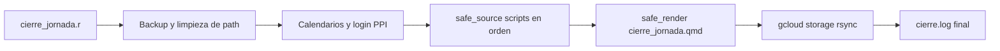

# Cierre de jornada

## Descripción

Pipeline diario en R que genera el **reporte de cierre de jornada**: descarga y procesa datos de mercado (reservas, MULC, FX, bonos, curvas, internacionales, etc.), escribe gráficos y artefactos en un directorio de salida, renderiza un informe HTML (`cierre_jornada.qmd` → `cierre_jornada.html`) y sincroniza esa carpeta con Google Cloud Storage.

El orquestador principal es **`cierre_jornada.r`**, que carga paquetes, define helpers (`safe_source`, `safe_render`, `safe_ppi_login`), ejecuta los scripts de cierre en **orden fijo** y al final corre el render y `gcloud storage rsync`.

---

## Punto de entrada: `cierre_jornada.r`

| Aspecto | Comportamiento en código |
|--------|---------------------------|
| **Directorio de trabajo** | `setwd("/home/jmt/dev/r/outlier/cierre_jornada")` — rutas absolutas del entorno donde corre el job; en otra máquina hay que alinear `setwd`, `path` y `path_source`. |
| **Setup** | `functions::setup(server = "GC")` y `outlier::theme_outlier()`. |
| **Rutas** | `path` = salida (`"/home/jmt/cierre-jornada"`); `path_source` = código fuente de los scripts (`"/home/jmt/dev/r/outlier/cierre_jornada"`). |
| **`safe_source`** | Envuelve `source()` con `R.utils::withTimeout` (default 600 s), registra inicio/éxito/error en `log_file`, y si existe el vector global `run_scripts`, **omite** los archivos que no estén en esa lista. Los errores no detienen el resto del pipeline. |
| **`run_scripts`** | Si hay **al menos dos** argumentos, `run_scripts <- args[-1]` (todos salvo el primero). Solo se ejecutan esos `basename`. El **primer** argumento sigue siendo el flag `update` solo si es `"true"` o `"false"`; si no lo es, `update` queda en `FALSE` pero igual puede haber `run_scripts` si pasás más de un argumento. En la práctica conviene: `Rscript cierre_jornada.r false archivo.R …` para ejecutar solo esos scripts. |
| **Argumentos CLI** | `args <- commandArgs(trailingOnly = TRUE)`. El **primer** argumento, si es `"true"` o `"false"` (cualquier capitalización), define `update` como lógico; si no hay args o no coincide, `update <- FALSE`. |
| **`update`** | Variable global usada por varios sub-scripts (p. ej. `cierre_boncer.R`, `cierre_tamar.R`, `cierre_dl.R`, `cierre_inflacionBE.R`, `cierre_intradiario.R`, `cierre_soberanos.R`, `cierre_lecaps_bonospesos.R`) para ramas que actualizan o releen datos. |
| **Logging** | `log_file <- file.path(path, "cierre.log")`; mensajes con `functions::log_msg`, `message`/`cat` y trazas de `safe_source` / `safe_render` / `gcloud`. |
| **Backup** | Antes de generar salidas nuevas: copia a `backup_path <- "/home/jmt/backup-cierre-jornada/<YYYYMMDD>` los archivos **del día anterior o más viejos** en `path`, borra backups con fecha &lt; hoy−7 días, luego elimina esos archivos del directorio de trabajo. |
| **Gráficos** | Se redefine `grabaGrafo` para envolver la versión base con `suppressMessages` y `suppressWarnings`. |
| **Render** | `safe_render()` llama `rmarkdown::render()` sobre `cierre_jornada.qmd` con `output_file` en `path/cierre_jornada.html` y `envir = .GlobalEnv`. |
| **Sync GCS** | `run_gcloud_storage_sync()` ejecuta `system2("/usr/bin/gcloud", ...)` con `storage rsync` de `path` hacia `gs://reportes-cierre-jornada`, recursivo y con borrado en destino de objetos no presentes en origen. |

---

## Orden de los sub-scripts (`safe_source`)

El orden importa: variables globales (`path`, `server`, `port`, `cal`, fechas, `fails`, etc.) se van poblando para el QMD y scripts posteriores.

1. **Reservas / MULC / FX** — `cierre_reservas.R`, `cierre_mulc.R`, `cierre_fx.R`
2. **Lecaps** — `cierre_lecaps_bonospesos.R`
3. **Tamar** — `cierre_tamar.R`, `cierre_be_tamar.R`
4. **Boncer** — `cierre_boncer.R`, `cierre_boncer_be.R`, `nelson_siegel.r`
5. **Linkers** — `cierre_dl.R`
6. **Caución / carry / inflación BE** — `cierre_caucion.R`, `cierre_lecaps_carry.R`, `cierre_inflacionBE.R`
7. **Internacionales** — `cierre_commodities.R`, `cierre_etf_comparables.R`, `cierre_monedas.R`, `cierre_indices.R`, `cierre_dxy_tnx.R`, `cierre_adrs.R`, `cierre_panel_etfs.R`, `cierre_merval.R`
8. **Agregados** — `cierre_depositos_gob.R`, `cierre_depo_dolar.R`, `cierre_tasas_adelantos.R`
9. **Bonos** — `cierre_intradiario.R`, `cierre_spread_legislacion.R`, `cierre_riesgo_pais.R`, `cierre_soberanos.R`, `cierre_deuda_ponderada.r`
10. **Futuros** — `cierre_int_rofex.R`, `cierre_rofex_curva.R`
11. **Varios** — `cierre_precios_indiferencia.R`

Luego: **render** del QMD y **sync** a GCS.

**Fuera del pipeline principal:** `migrar_tablas.R` no aparece en `cierre_jornada.r` (utilidad aparte).

---

## Dependencias

### Paquetes R (`library` / `require` en `cierre_jornada.r`)

`bizdays`, `tidyverse`, `functions`, `bcra`, `finance`, `outlier`, `methodsPPI`, `bdscale`, `scales`, `ggthemes`, `ggrepel`, `flextable`, `slider`, `jsonlite`, `zoo`, `tidyquant`, `purrr`, `httr2`, `patchwork`, `gghighlight`, `rofex`, `officer`, `R.utils`.

Además, el render usa **`rmarkdown`** vía `rmarkdown::render()` sin `library(rmarkdown)` explícito.

### Servicios y datos externos

- **Base de datos:** `functions::setup`, `dbGetTable`, `dbExecuteQuery`, `dbWriteDF`, etc. (p. ej. feriados USA, `precios_bonos_cer`, **`boncer_dinamica`**, y **`paridades_historicas_globales`** en [cierre_deuda_ponderada.r](cierre_deuda_ponderada.r) para precios+paridades de globales GD; **`nelson_siegel.r`** solo lee `boncer_dinamica`, sin `.rds`).
- **PPI:** `methodsPPI::getPPILogin()` en `safe_ppi_login()`; si falla, se registra el error y el proceso **continúa** (`ppi_login_ok` no corta el flujo en el orquestador).
- **Google Cloud:** CLI `gcloud` en `/usr/bin/gcloud` para `storage rsync` al bucket `gs://reportes-cierre-jornada`.

---

## Salidas principales

| Ubicación | Contenido típico |
|-----------|-------------------|
| **`path`** (`/home/jmt/cierre-jornada` en el código) | HTML del reporte, gráficos generados por `grabaGrafo` (envuelto en `cierre_jornada.r`), logs, RDS intermedios según cada script (la serie dinámica BONCER **no** se guarda en `.rds`; vive solo en la tabla `boncer_dinamica`). |
| **`cierre_jornada.html`** | Informe renderizado desde `cierre_jornada.qmd`. |
| **`cierre.log`** | Traza del proceso, errores por script, sync gcloud. |
| **Gráficos** | Los sub-scripts llaman a `grabaGrafo` (helper `functions` / `outlier`) escribiendo en `path`. |
| **Backup** | `backup_path`: copias por fecha bajo `/home/jmt/backup-cierre-jornada/<YYYYMMDD>`. |

---

## Tabla `boncer_dinamica` y `nelson_siegel.r`

- **`cierre_boncer.R`** mantiene la serie dinámica de BONCER en PostgreSQL en la tabla **`boncer_dinamica`**: `CREATE TABLE IF NOT EXISTS` y clave primaria **`(date, ticker)`**. El flujo es **incremental** respecto a `max(date)` en esa tabla:
  - **Tabla vacía o sin máximo válido:** **bootstrap** — se leen precios de `precios_bonos_cer` con `date >= from_dinamica`, se calculan yields (y columnas asociadas) para ese rango y se insertan con `functions::dbWriteDF` (`append = TRUE`).
  - **Tabla ya poblada:** **incremental** — solo se leen filas de `precios_bonos_cer` con **`date > max(date)`** de `boncer_dinamica`, se enriquecen y se hace **append** igual que arriba.
  - Para gráficos en el mismo script, la serie en memoria se arma con `SELECT * FROM boncer_dinamica WHERE date >= from_dinamica` (histórico acumulado en tabla).
- **Archivo `boncer_dinamica.rds`:** ya **no** se escribe ni se lee; la persistencia y el consumo posterior pasan **solo** por la tabla y consultas SQL.
- **`nelson_siegel.r`** corre **después** de `cierre_boncer.R` y `cierre_boncer_be.R` (orden fijado en `cierre_jornada.r`). Carga datos **únicamente** con `SELECT * FROM boncer_dinamica WHERE date >= from_dinamica` (sin lectura de RDS ni otro fallback). Si la consulta falla o no hay filas, registra advertencia en `cierre.log` y **omite** el resto; si hay pocas filas válidas tras filtros, también puede omitir con otro mensaje. Con datos suficientes, ajusta curvas reales CER con Nelson–Siegel y genera gráficos con `grabaGrafo` (mismo helper que el resto del cierre, envuelto en `cierre_jornada.r`).

## Tabla `paridades_historicas_globales` ([`cierre_deuda_ponderada.r`](cierre_deuda_ponderada.r))

- Persiste el resultado de `getPPIPriceHistoryMultiple3` + `getYields` (precio y paridad por bono global) con clave **`(date, ticker)`**.
- **Bootstrap** si la tabla está vacía: se pide la API desde `from` (`2020-09-01`) hasta `to` (`Sys.Date()`), se calculan paridades para todo el lote y se hace `append` con `dbWriteDF`.
- **Incremental** si ya hay datos: `max(date)` en la tabla; si `max(date) + 1 <= to`, se pide solo ese rango a la API, se enriquece y se append; si la tabla ya está al día, no se llama a la API.
- El análisis (ponderación y gráficos) sigue leyendo un **`SELECT * ... WHERE date >= from`** sobre la tabla, no el histórico completo recalculado en memoria cada vez.

---

## Ejecución (referencia)

```bash
# Ejecución completa, sin modo update explícito (update=FALSE si no se pasa true/false)
Rscript cierre_jornada.r

# Primer argumento: actualizar bases donde el script lo use
Rscript cierre_jornada.r true

# Solo algunos scripts (ej.: solo boncer y nelson)
Rscript cierre_jornada.r false cierre_boncer.R cierre_boncer_be.R nelson_siegel.r
```

*(Las rutas de `Rscript` y del archivo deben apuntar al `path_source` real del servidor.)*

**Filtrado de scripts:** con un solo argumento que no sea `true`/`false` (p. ej. solo el nombre de un script), `run_scripts` sigue siendo `NULL` y corre el pipeline completo. Para limitar la ejecución, el primer argumento debe ser explícitamente `true` o `false` y los siguientes los basenames de los `.R`/`.r` a incluir.

---

## Estructura del repositorio

| Elemento | Rol |
|----------|-----|
| `cierre_jornada.r` | Orquestador: `source` de todos los módulos, render y sync. |
| `cierre_*.R` / `cierre_*.r` | Módulos por tema (FX, bonos, Rofex, etc.); se invocan solo desde el orquestador salvo pruebas manuales. |
| `cierre_jornada.qmd` | Fuente del informe HTML; usa objetos del `.GlobalEnv` tras los `source`. |
| Otros | Utilidades p. ej. `migrar_tablas.R` (no enlazada al pipeline principal). |

El código fuente vive en `path_source`; las salidas (HTML, PNG/PDF de gráficos, `.rds` donde cada script lo use, `cierre.log`) se escriben en `path` (en el código del servidor: rutas bajo `/home/jmt/...`). La dinámica BONCER no añade un `.rds` propio: queda en la tabla `boncer_dinamica`.

---

## Diagrama de flujo (alto nivel)


